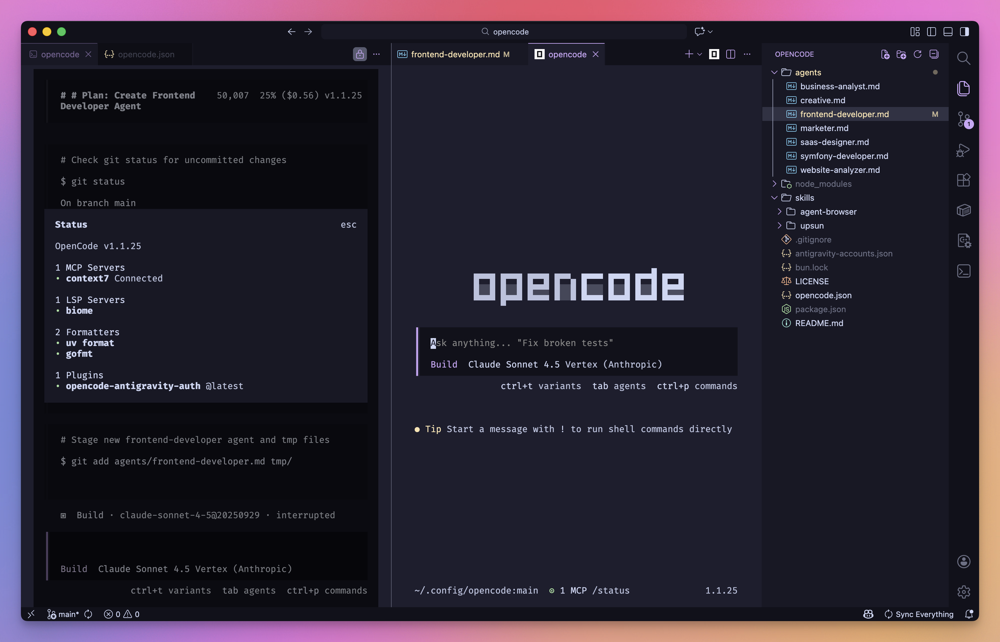

# OpenCode Configuration

Personal [OpenCode](https://opencode.ai) configuration with custom agents, skills, and provider models.



## Features

- **Granular Permissions**: Pre-configured access to `~/psh`, `~/projects`, and `~/.config/opencode`
- **Custom Agents**: Specialized agents including SaaS designer
- **Skills**: Upsun PaaS management and browser automation
- **Provider Models**: Antigravity-hosted Gemini 3 and Claude models

## Structure

```
~/.config/opencode/
├── opencode.json      # Main configuration
├── agents/            # Custom agent definitions
│   ├── business-analyst.md
│   ├── creative.md
│   ├── frontend-developer.md
│   ├── marketer.md
│   ├── saas-designer.md
│   ├── symfony-developer.md
│   └── website-analyzer.md
└── skills/            # Agent skills
    ├── agent-browser/
    └── upsun/
```

## Agents

| Agent | Description |
|-------|-------------|
| **business-analyst** | Evaluates business viability, market fit, and opportunity analysis for ideas |
| **creative** | Generates innovative variations and explores creative directions for ideas |
| **marketer** | Develops positioning, messaging, and go-to-market strategies for products |
| **saas-designer** | Designs production-grade SaaS dashboards with React, Tailwind CSS v4, and shadcn/ui |
| **frontend-developer** | Frontend expert implementing type-safe applications with TanStack Start, React 19, and modern web patterns |
| **website-analyzer** | Analyzes website designs using Chrome DevTools to create comprehensive design specs for React/TanStack/Tailwind recreation |
| **symfony-developer** | Expert Symfony developer writing high-quality, tested code following best practices with browser testing support |

## Skills

| Skill | Description |
|-------|-------------|
| **agent-browser** | Browser automation for web testing, form filling, screenshots, and data extraction |
| **upsun** | Manage Upsun Platform-as-a-Service projects: deployments, environments, backups, scaling, and more |
| **frontend-design** | Create distinctive, production-grade frontend interfaces with high design quality using modern frameworks |

## Permissions

| Tool   | Default | Allowed Paths                                      |
|--------|---------|---------------------------------------------------|
| read   | ask     | ~/psh/*, ~/projects/*, ~/.config/opencode/*, ~/.ssh/*, ~/.gitconfig, ~/.npmrc, ~/.pnpmrc, ~/.symfony/* |
| edit   | ask     | ~/psh/*, ~/projects/*, ~/.config/opencode/*       |
| glob   | ask     | ~/psh/*, ~/projects/*, ~/.config/opencode/*       |
| list   | ask     | ~/psh/*, ~/projects/*, ~/.config/opencode/*       |
| bash   | ask     | git, npm, pnpm, node, symfony, upsun, agent-browser, grep |

## Models

Custom Antigravity-hosted models available:

- **Gemini 3 Pro** - Multi-modal with thinking variants (low/high)
- **Gemini 3 Flash** - Fast model with thinking variants (minimal/low/medium/high)
- **Claude Sonnet 4.5** - Standard and thinking variants (low/max budget)
- **Claude Opus 4.5** - Thinking variants (low/max budget)

Standard Gemini CLI models also configured:

- Gemini 2.5 Pro / Flash
- Gemini 3 Pro / Flash Preview

## MCP Servers

- **Context7**: Documentation lookup via `https://mcp.context7.com/mcp`

## License

Apache License 2.0 - see [LICENSE](LICENSE)
